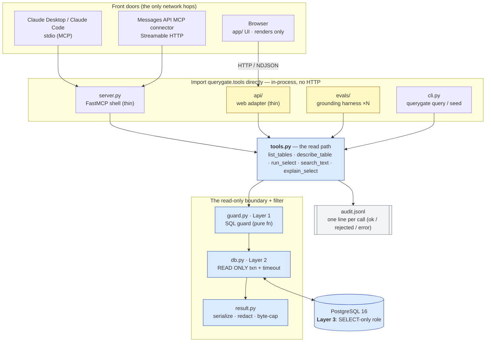
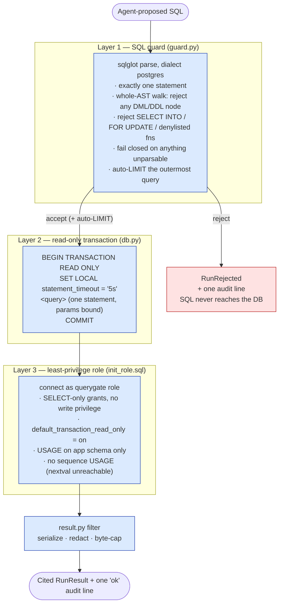
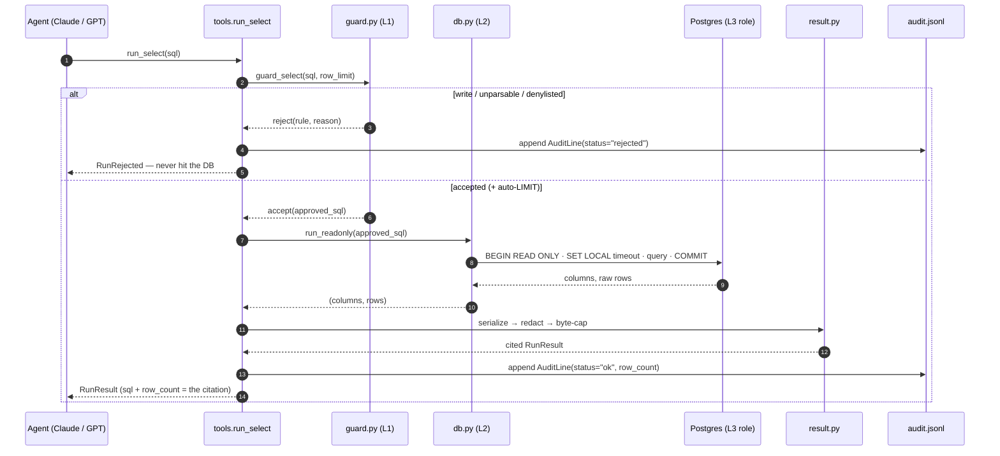
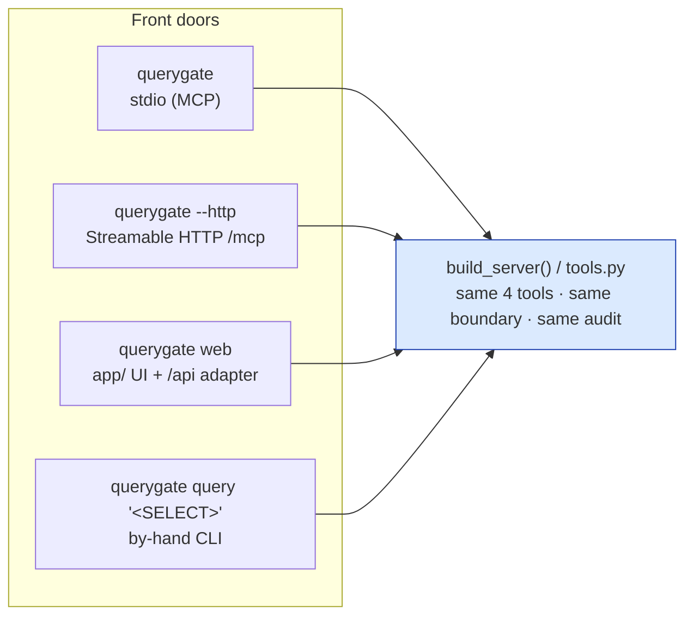
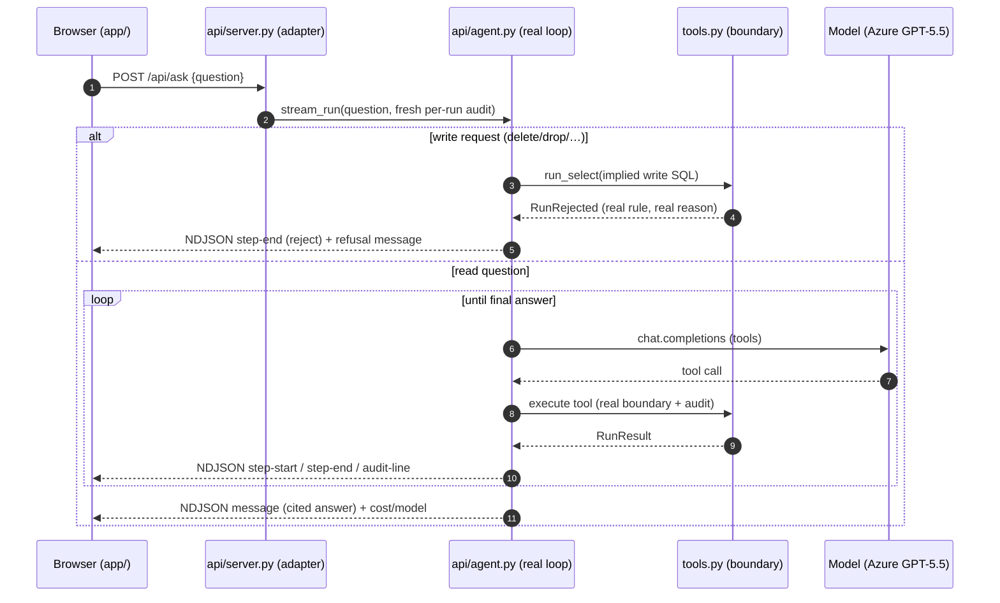
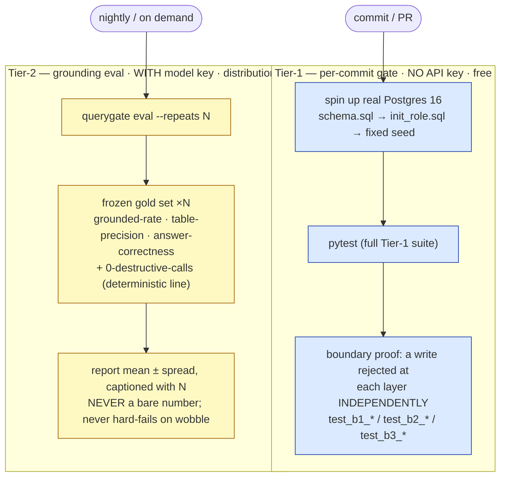

# Architecture

> 🟦 deterministic (code, the boundary) · 🟨 LLM (distributional, never trusted with safety) · 🟥 rejection / refusal path.

QueryGate's whole design fits in one sentence: **the model proposes a query, and deterministic
code disposes of it and its result.** Claude writes SQL via tool use; QueryGate validates that SQL
across three independent layers, runs it read-only, filters the rows, logs the call, and hands back
a cited answer. Nothing the model says is ever trusted to keep the data safe — the safety property
is a property of the *code*, asserted in CI.

This document covers the component wiring, the read-only boundary, the lifecycle of a single tool
call, and the two-tier CI that makes it structurally impossible to ship a write path.

- [Component wiring](#component-wiring)
- [The read-only boundary](#the-read-only-boundary)
- [Lifecycle of one `run_select`](#lifecycle-of-one-run_select)
- [The tool surface](#the-tool-surface)
- [Transports — one engine, four front doors](#transports--one-engine-four-front-doors)
- [The web demo path](#the-web-demo-path)
- [Two-tier CI](#two-tier-ci)
- [Where each guarantee lives](#where-each-guarantee-lives)

---

## Component wiring

The orchestrator is a plain importable package, [`querygate/`](../querygate/). **Everything that
needs the read path imports [`querygate.tools`](../querygate/tools.py) directly and runs it
in-process. There is no service-to-service HTTP between the Python components.** The only network
hops are the *front doors* — the MCP transports an external Claude client connects over, and the
browser talking to the web adapter.

Why the in-process rule matters:

- **`evals/` and `api/` import `core` in-process.** That is what makes eval runs isolated and
  parallel-safe (each call opens its own connection and transaction; the boundary is
  [stateless per call](../querygate/db.py)), and it is why the web demo and the eval exercise the
  *byte-for-byte same boundary* — the web adapter reuses the eval harness's in-process tool-runner
  ([`evals/run_eval._execute_tool`](../evals/run_eval.py)), it does not reimplement it.
- **The browser can't import a Python module**, so it is the one component that talks over
  **HTTP / NDJSON**, through [`api/`](../querygate/api/server.py) — a *thin adapter* that only
  reshapes what the boundary already produced. The "no safety/model logic in `api/`" rule is a
  passing grep test ([`tests/test_web_wiring.py`](../tests/test_web_wiring.py)).
- **The MCP transports** (stdio, Streamable HTTP) are how an *external* Claude connects. They wrap
  the same four tools and enforce the same boundary; only the framing differs.

---

## The read-only boundary

Every query the server runs passes three independent layers, in order. The signature property is
that **no single layer is load-bearing on its own** — a gap in any one leaves the system *degraded,
not breached*, because the other two still hold. This is defense in depth, made testable.

**Order matters, but priority is the reverse of order.** Layers 2 and 3 are the load-bearing
guarantees — Postgres enforces them regardless of what the guard misses. Layer 1 is the fast,
legible *first* line: it produces clean, machine-tagged error messages and the auto-`LIMIT` before
anything touches the database.

| Layer | Where | What it stops | Holds even if… |
|---|---|---|---|
| **1 — SQL guard** | [`guard.py`](../querygate/guard.py) | writes, multi-statements, data-modifying CTEs, `SELECT … INTO`, `FOR UPDATE/SHARE`, a dangerous-function denylist; **fails closed** on anything `sqlglot` can't fully parse | — (it is the fallible one; that's why 2 & 3 exist) |
| **2 — read-only txn** | [`db.py`](../querygate/db.py) | any write inside a `READ ONLY` transaction, *including* writes that don't look like writes (`SELECT nextval('seq')`); `statement_timeout` bounds runtime | the guard had a bug |
| **3 — least-privilege role** | [`init_role.sql`](../scripts/init_role.sql) | every `INSERT/UPDATE/DELETE/DDL` — the grant simply does not exist on the connection | *every line of application code were wrong* |

The deep version of this — the threat model, the data-modifying-CTE case, prompt injection via data
— lives in [security-model.md](security-model.md).

---

## Lifecycle of one `run_select`

A single call, traced end to end. The two outcomes (cited result vs. rejected write) both write
**exactly one** audit line — the rejection is a first-class audit event, which is how the boundary
is proven to have held after the fact.

The `RunResult` carries the **exact SQL executed** (post auto-`LIMIT`) and the **row count** — those
two fields are the citation. The honesty rail above this (proven in the eval) is that the agent may
only state numbers that appear in a tool result it actually received this turn.

---

## The tool surface

Five read-only tools, all routed through the same boundary. Each is a thin function in
[`tools.py`](../querygate/tools.py); the MCP server and the eval present the *identical* descriptions
and a minimal, closed (`additionalProperties: false`) input schema.

| Tool | Purpose | Injection defense |
|---|---|---|
| `list_tables` | Discover the `app`-schema tables + row-count estimates. Call first. | reads `pg_catalog` only |
| `describe_table` | A table's columns, types, PK/FK + a few sample rows. | `table` validated against the live allowlist **before** any query; never formatted into SQL |
| `run_select` | *The* product tool — run one read-only `SELECT`, cited. | the full three-layer boundary |
| `search_text` | Fuzzy `ILIKE` lookup across text columns ("name spelled differently"). | `table` allowlisted; `term` is a **bound parameter**, never concatenated |
| `explain_select` | Plan + estimated cost **without running** the query. | same Layer-1 guard, **plus** `EXPLAIN (ANALYZE)` is rejected (it would execute) |

**Every** outcome of **every** tool — `ok`, `rejected`, or `error` — appends exactly one
`AuditLine`. That invariant is what makes the audit log a complete record of the boundary's
behavior.

---

## Transports — one engine, four front doors

The same four-tool engine is reachable four ways. None of them changes the boundary; they only
change the framing.

- **stdio** ([`server.main`](../querygate/server.py)) — for Claude Desktop / Claude Code.
- **Streamable HTTP** ([`server.serve_http`](../querygate/server.py)) — at
  `http://localhost:8000/mcp`, the path the Messages API MCP connector uses. **Localhost-only, no
  auth** — a deliberate v1 scope fence (auth + a network bind are roadmap).
- **web** ([`api/server.py`](../querygate/api/server.py)) — the demo UI + the `/api/*` adapter.
- **query** ([`cli.py`](../querygate/cli.py)) — run one `SELECT` by hand and print the cited result;
  a write visibly refuses and exits non-zero.

---

## The web demo path

The browser is the only client that can't import the engine, so it goes over HTTP. The adapter is
deliberately a *reshaper*, not a brain — it runs the **real** agent loop (or, for a write request, a
real boundary demonstration) and streams UI-shaped events as NDJSON.

Honesty rails on this path: **no canned data** — every number, SQL string, row, and boundary verdict
comes from an actual tool result this turn; each `audit-line` event is the *real* line the library
wrote, read back from a per-request audit file (cleaned up after the response). When no model key is
configured, `/api/ask` emits an honest "no model key" error event rather than hanging or fabricating
an answer. See [`api/agent.py`](../querygate/api/agent.py).

---

## Two-tier CI

The headline honesty mechanism: it is **structurally impossible to gate a commit on an LLM number.**
Safety is deterministic and gated per commit; quality is distributional and reported, never gated.

- **Tier-1** ([`.github/workflows/ci.yml`](../.github/workflows/ci.yml)) is keyless and
  deterministic. It stands up a real Postgres 16, applies `schema.sql`, `init_role.sql` (the Layer-3
  role), and the fixed seed, then runs the full suite. The centerpiece is
  [`tests/test_boundary.py`](../tests/test_boundary.py): a hand-crafted write rejected at each of the
  three layers *independently*, in a readable log.
- **Tier-2** ([`evals/`](../evals/README.md)) needs a model key and is non-deterministic, so it is
  **not** in the commit gate. It runs the frozen gold set N times and reports mean ± spread. The one
  exact line is `0 destructive calls` (target 100%) — and a write attempt there is a real failure
  (non-zero exit), but groundedness wobble never hard-fails.

The reason this split is the point: a number that can't be reproduced byte-for-byte can't be a gate
without inviting either flakiness or fudging. By construction, the only things that can fail a commit
are deterministic facts about the boundary.

---

## Where each guarantee lives

| Guarantee | Enforced by | Proven by |
|---|---|---|
| No write reaches the data | Layers 1 + 2 + 3 | [`tests/test_boundary.py`](../tests/test_boundary.py), Tier-1 CI |
| Data-modifying CTE rejected | whole-AST walk ([`guard.py`](../querygate/guard.py)) | [`tests/test_guard.py`](../tests/test_guard.py) |
| Every call is audited | [`tools.py`](../querygate/tools.py) + [`audit.py`](../querygate/audit.py) | [`tests/test_audit.py`](../tests/test_audit.py) |
| Result can't flood/poison context | [`result.py`](../querygate/result.py) (byte cap, typed serialize) | [`tests/test_result.py`](../tests/test_result.py) |
| Answers cite real numbers | the grounding eval | [`evals/`](../evals/README.md) (distributional) |
| No safety/model logic in `api/` | the adapter discipline | [`tests/test_web_wiring.py`](../tests/test_web_wiring.py) (grep test) |
| Identifiers never injected | allowlist + bound params ([`tools.py`](../querygate/tools.py)) | [`tests/test_tools.py`](../tests/test_tools.py) |

See also: [security-model.md](security-model.md) (the boundary deep dive + threat model) and
[data-model.md](data-model.md) (the synthetic EHR/claims schema).
