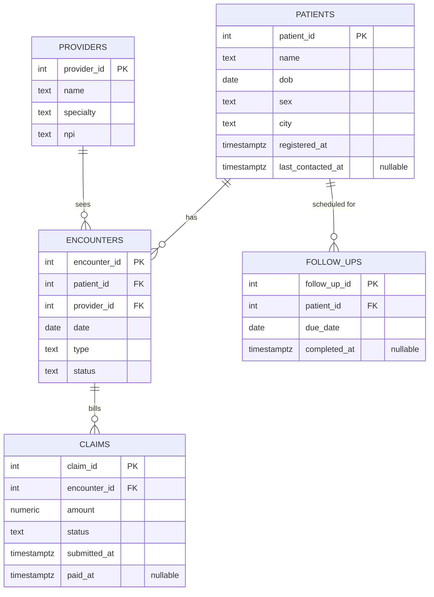
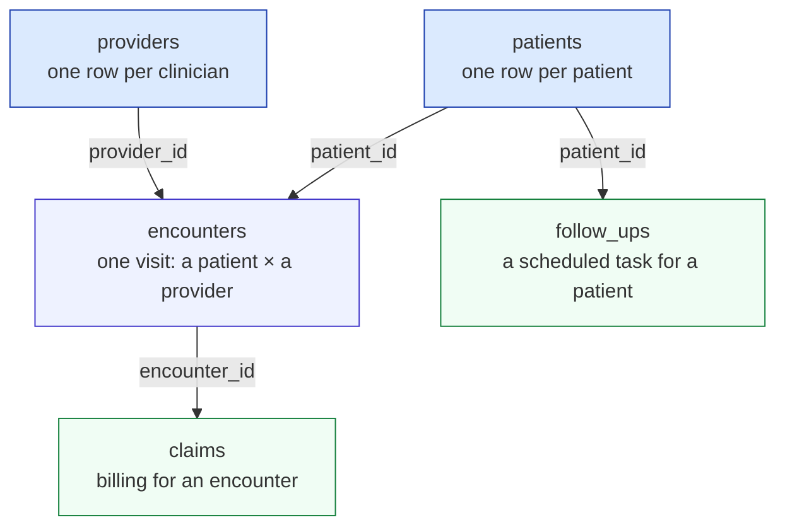
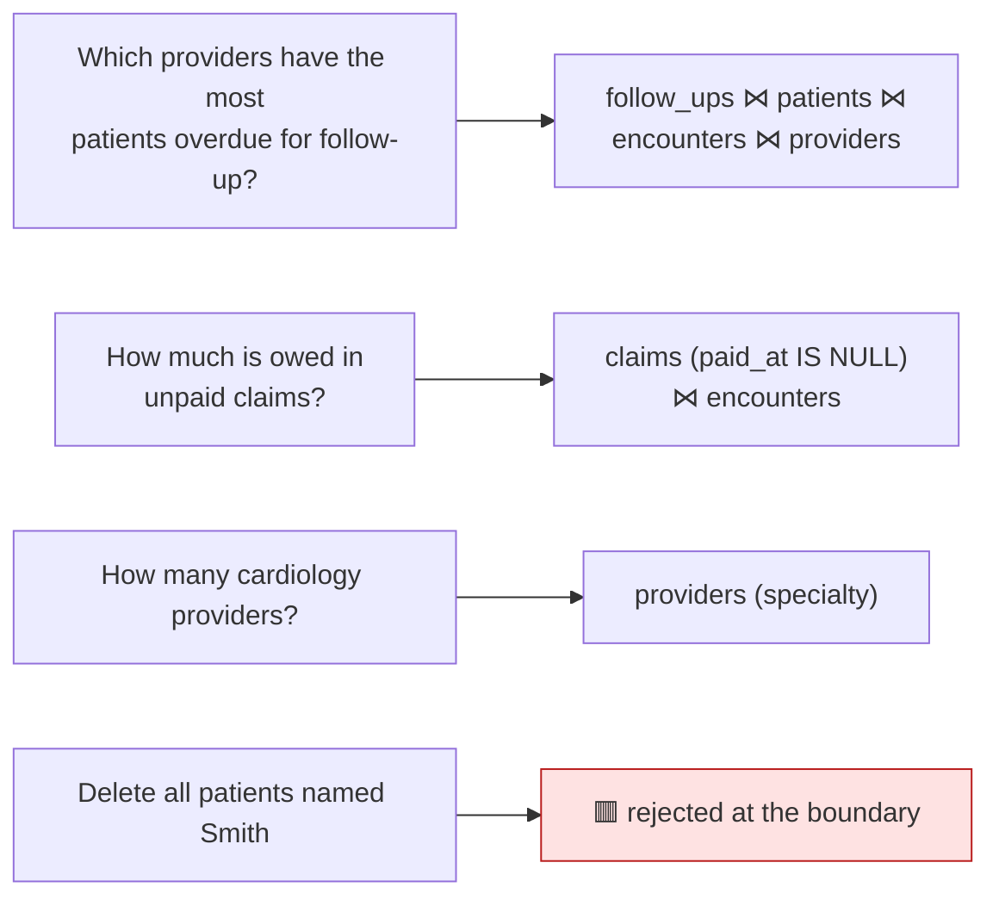

# Data model

The demo ships against a **synthetic EHR/claims database** — so it doubles as a
healthcare-compliance showcase (PHI-aware framing, audit trail, least-privilege access, optional
column redaction) without exposing any real data. This document describes that schema, how the
deterministic seed keeps it stable, and the questions it is designed to answer.

- [Schema](#schema)
- [Entity relationships](#entity-relationships)
- [Tables](#tables)
- [Determinism](#determinism)
- [Questions the schema answers](#questions-the-schema-answers)
- [PHI columns](#phi-columns)

All tables live in a dedicated **`app` schema** (never `public`), so the least-privilege role gets
`USAGE` on `app` only and `public` stays write-locked. The structure is in
[`scripts/schema.sql`](../scripts/schema.sql); the data is loaded by
[`scripts/seed.py`](../scripts/seed.py).

---

## Schema

Five tables: three "core" entities (`patients`, `providers`, `encounters`) and two that hang off
them (`claims` on encounters, `follow_ups` on patients).

---

## Entity relationships

The grain of each table, read top to bottom:

All foreign keys are **single-column** (which is why `describe_table` can pair `conkey`/`confkey`
1:1 when it reports relationships). There are no many-to-many join tables in v1.

---

## Tables

| Table | Grain | Key columns | Notable nullable |
|---|---|---|---|
| `patients` | one patient | `patient_id` PK | `last_contacted_at` (not every patient has been contacted) |
| `providers` | one clinician | `provider_id` PK | — |
| `encounters` | one visit (patient × provider) | `encounter_id` PK, FK → `patients`, `providers` | — |
| `claims` | billing for an encounter | `claim_id` PK, FK → `encounters`; `amount numeric(12,2)` | `paid_at` (unpaid/denied claims have none) |
| `follow_ups` | a scheduled task for a patient | `follow_up_id` PK, FK → `patients` | `completed_at` (`NULL` = not done → **overdue** if past `due_date`) |

The nullable columns are deliberate — they are what makes the demo's signature questions
("overdue follow-ups", "unpaid claims") meaningful rather than trivial.

> **`numeric` note.** `claims.amount` is `numeric(12,2)`. The result filter serializes `Decimal` to
> `float` by default, or to a lossless `str` when `QUERYGATE_DECIMAL_AS_STR` is set — the per-column
> money switch. See [`result.py`](../querygate/result.py).

---

## Determinism

The dataset is **byte-identical on every run**, which is what lets Tier-1 CI assert exact row counts
on a clean machine. From [`scripts/seed.py`](../scripts/seed.py) and
[`scripts/README.md`](../scripts/README.md):

- Fixed `Faker`/`random` seeds (42) and a **pinned Faker version** (versions drift their output even
  with a fixed seed).
- Fixed row counts per table.
- **Time-stable date bands.** Overdue follow-ups sit years in the past, not-due ones years in the
  future, with nothing near "now" — so "how many overdue" returns the same number today or years
  from now.

Expected counts are asserted in [`tests/test_seed_and_role.py`](../tests/test_seed_and_role.py). The
seed is idempotent (truncate-and-reload), so `querygate seed --reset` always lands the same DB.

---

## Questions the schema answers

The schema is shaped around the demo's two beats and the [frozen gold set](../evals/questions.jsonl):

- **Time-relative** questions (overdue, the money demo) use the SQL-predicate form of the gold set's
  `expected_answer_check`, recomputed against the live DB at eval time — so they self-adjust with
  `now()` and never rot.
- **Time-stable** questions (e.g. "how many cardiology providers") use a frozen expected number.
- **Refusal** items ask for a write; they prove at the *agent* level what the boundary tests prove
  in code.

---

## PHI columns

The redaction demo masks the columns a real EHR would treat as PHI. The shipped
[`redact.yaml`](../redact.yaml) lists:

| Column | Why |
|---|---|
| `patients.name` | direct identifier |
| `patients.dob` | quasi-identifier (date of birth) |

With redaction on, those cells return as `***` in every result and are recorded in the audit log —
without hiding them from `WHERE`/aggregates (a `count(*)` over `name` still returns the true count).
See [security-model.md](security-model.md#phi-handling-the-redaction-switch) for the precise
semantics.
